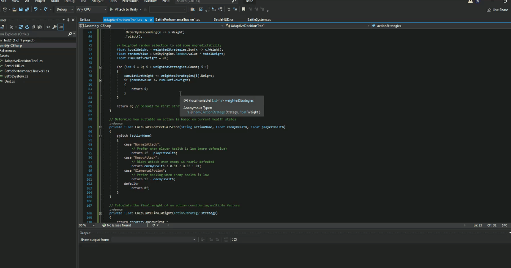

# John Robert Alexander Portfolio

## About

Hi, I'm John, and I'm currently at Abertay University studying Computer Games Applications of Development.

## Pen and Sword

I was one of three programmers for Pen and Sword, which is a top-down 2D tower defence style game. This was developed using the Unity game engine, and I was responsible for creating the AI pathfinding for the enemies, which involved the enemies navigation, logic and behaviour patterns to give the player a challenge.

## Adaptive decision tree AI 

I made a game with an adaptive decision tree AI that dynamically adapts its strategies by calculating contextual relevance and of actions and continuously updates success rates using a moving average. It also uses weighted random selection to make it more unpredictable making it more engaging. 

